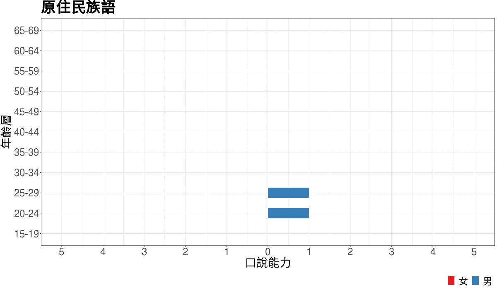

```{r setup, include=FALSE}
knitr::opts_chunk$set(
	echo = FALSE,
	message = FALSE,
	warning = FALSE
)
```


```{r results='hide', message=FALSE, warning=FALSE, paged.print=FALSE}
source("shape.R")
```


```{r, fig.width=8}
knitr::include_graphics("./out_graph/plot.gif")
```

```{r}

```

