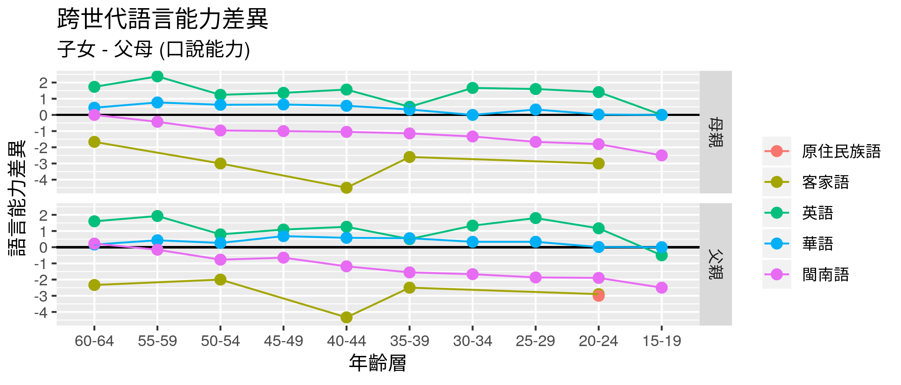

## List of Files/Folders

```
data/
interactive_graph/
shape/
archives/

data_import_clean.R

ggplot_age_pyramid.R
shape.R
techniques.R
tmap.R
```

### Analysis Scripts
- `data_import_clean.R`
    - Inputs: From web
    - Relation with `../web_source/index.Rmd`
        - Indirect: Run before rendering web (by bash command in `.travis.yml`), save `./data/survey.rds`, `./data/survey.csv` to `./data/`.
    - Outputs: `./data/survey.rds`, `./data/survey.csv`  
    - Description: Read data from googlesheets, clean data for further analysis.

- `gen_diff_categorical.R`
    - Inputs: `./data/survey.rds`
    - Relation with `../web_source/index.Rmd`
        - Direct: `index.Rmd` source `gen_diff_categorical.R` and run `pl_Mand_crossgen_bar` in the code chunk. Hence, figure is svg on the web.
    - Outputs: `pl_Mand_crossgen_bar`  
      

- `animated_bar.R`
    - Inputs: `./data/survey.rds`, `source("functions.R")`
    - Relation with `../web_source/index.Rmd`
        - Indirect: Run before rendering web (by bash command in `.travis.yml`), save gif to `../web_source/out_graph/`. `index.Rmd` include_graphics in `outgraph/`.
    - Outputs: `age_pyramid.gif`  
      

- `cross_gen_lang_ability_ttest.R`
    - Inputs: `./data/survey.rds`, `source("functions.R")`
    - Relation with `../web_source/index.Rmd`
        - Direct: `index.Rmd` source `cross_gen_lang_ability_ttest.R` and run `pl_full_diff` in the code chunk. Hence, figure is svg on the web.
    - Outputs: `pl_full_diff`  
      

- `facet_animated_map.R`
    - Inputs: `./data/zipcode_towncode.csv`, `./data/survey.rds`, `source("functions.R")`, `./shape/TOWN_MOI_1070330.shp`
    - Relation with `../web_source/index.Rmd`
        - Indirect: Run before rendering web (by bash command in `.travis.yml`), save gif to `../web_source/out_graph/`. `index.Rmd` include_graphics in `outgraph/`.
    - Outputs: `g1`  
      

#### Helper Scripts
- `functions.R`
    - Inputs: Nothing
    - Relation with `../web_source/index.Rmd`
        - Indirect: Sourced by other scripts but not by `index.Rmd`.
    - Outputs: Nothing
    - Description: Define helper functions to make codes in other scripts more compacted.
     
- `bootstrap_fc.R`
    - Inputs: Nothing
    - Relation with `../web_source/index.Rmd`
        - Direct: `bootstrap_fc.R` is **only** sourced by `index.Rmd`.
    - Outputs: Nothing
    - Description: Define R functions that wrap HTML defined bootstrap codes to make it easier to format the web (the `.Rmd`s).

### Other Scripts (Not relevant to building the web)
- `./archives/ggplot_age_pyramid.R`: Experiment with animated bar plot.
- `shape.R`: Experiment with package 'sf' & shapefile I/O.
- `tmap.R`: Experiment with package 'tmap' for map making.
- `techniques.R`: Playing around.

### Data Sources
- `shape/`: 台灣鄉鎮市區界線 [政府開放資料](https://data.gov.tw/dataset/7441)
