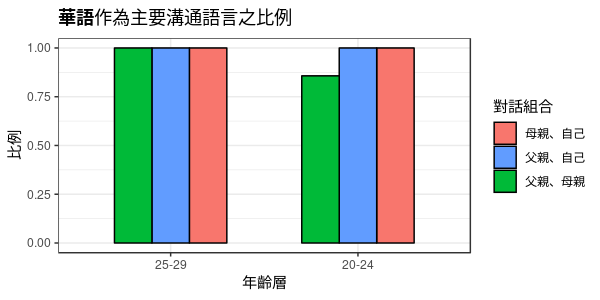

## List of Files/Folders

```
data/
interactive_graph/
shape/
archives/

data_import_clean.R

ggplot_age_pyramid.R
shape.R
techniques.R
tmap.R
```

### Analysis Scripts
- `data_import_clean.R`
    - Inputs: From web
    - Outputs: `./data/survey.rds`, `./data/survey.csv`  
    - Description: Read data from googlesheets, clean data for further analysis.

- `gen_diff_categorical.R`
    - Inputs: `./data/survey.rds`
    - Outputs: `pl_Mand_crossgen_bar`  
      


### Other Scripts (Not relevant to building the web)
- `ggplot_age_pyramid.R`: Experiment with animated bar plot.
- `shape.R`: Experiment with package 'sf' & shapefile I/O.
- `tmap.R`: Experiment with package 'tmap' for map making.
- `techniques.R`: Playing around.

### Data Sources
- `shape/`: 台灣鄉鎮市區界線 [政府開放資料](https://data.gov.tw/dataset/7441)
