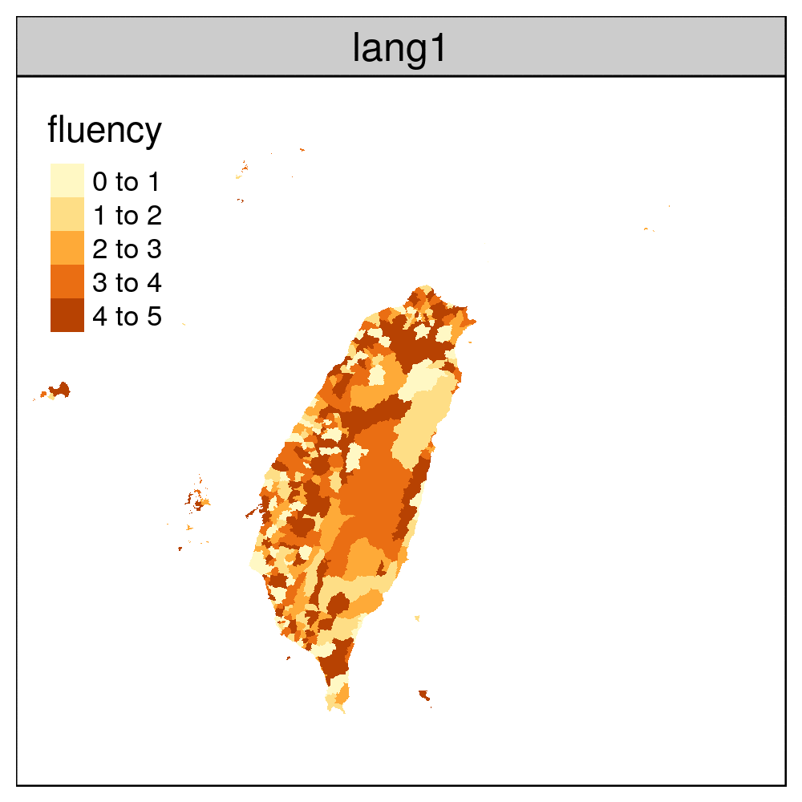

```{r setup, include=FALSE}
library(svglite)
knitr::opts_knit$set(root.dir='..')
knitr::opts_chunk$set(
	echo = FALSE,
	message = FALSE,
	warning = FALSE,
	dev='svglite', comment="")
	# fig.dim = c(3.5, 3.5)  # (width, height)
knitr::opts_knit$set(root.dir='../rscript')
Sys.setenv(TZ="Asia/Taipei")
library(widgetframe)
knitr::opts_chunk$set(widgetframe_self_contained = FALSE) 
knitr::opts_chunk$set(widgetframe_isolate_widgets = TRUE) 
knitr::opts_chunk$set(widgetframe_widgets_dir = './interactive_graph' )
```

<div style="text-align: right">
<p style="font-size:8px">
上次更新：`r Sys.time()`
</p>
</div>

```{r out.width="70%"}

```


```{r}
knitr::include_graphics("./out_graph/age_pyramid.gif")
```

```{r results='hide', message=FALSE, warning=FALSE, paged.print=FALSE}
source("tmap.R")
```

```{r}
#tmap_mode("view")
frameWidget(tmap_leaflet(map), width='85%')
```


  
  
<br><br><br><br><br><br><br>
