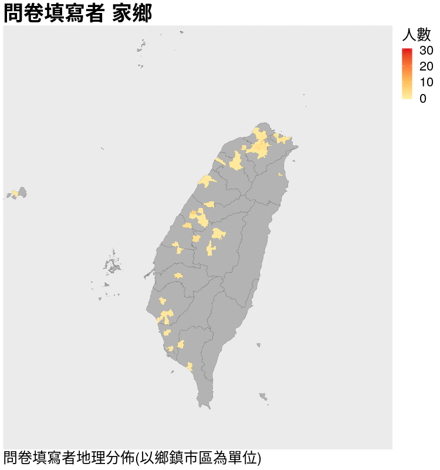
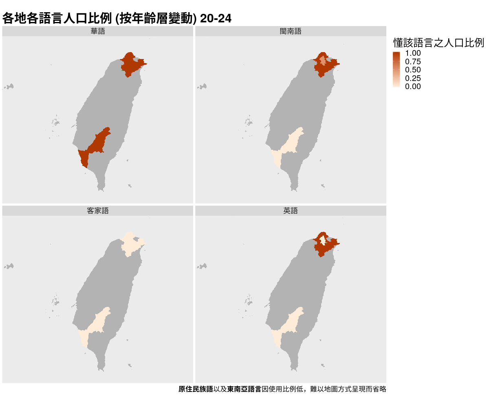

```{r setup, include=FALSE}
knitr::opts_knit$set(root.dir='..')
knitr::opts_chunk$set(
	echo = FALSE,
	message = FALSE,
	warning = FALSE,
	dev='svg', comment="")
	# fig.dim = c(3.5, 3.5)  # (width, height)
knitr::opts_knit$set(root.dir='../rscript')
Sys.setenv(TZ="Asia/Taipei")
library(widgetframe)
knitr::opts_chunk$set(widgetframe_self_contained = FALSE) 
knitr::opts_chunk$set(widgetframe_isolate_widgets = TRUE) 
knitr::opts_chunk$set(widgetframe_widgets_dir = './interactive_graph' )
source("bootstrap_fc.R")
```

<p style="text-align:right; font-size:7.5px">
上次更新：`r Sys.Date()`
</p>


## 前言

此網頁是為了[臺灣地區語言使用調查](https://docs.google.com/forms/d/e/1FAIpQLSeCZpWjEEcK7sE7qBoO8BIem3M79iz5NB-7FIcaGgvytakQ2A/viewform)這份問卷而設計的。**臺灣地區語言使用調查**是為了解臺灣各語言的使用情況，特別是華語(國語)以外的弱勢語言；這個網頁則是為了即時將問卷分析結果和大家分享，希望藉此引起大家對臺灣多語社會以及弱勢語言的關注。

接下來將透過幾段文字和幾張圖片，描述臺灣語言的現況[^reliability]，並會聚焦在**跨年齡層**以及**跨世代**的語言流失現象。


[^reliability]: 必須注意的是**網路問卷的侷限性**：此網頁所根據的網路問卷樣本可能過度集中在單一地區、身份或年齡層。因此，請讀者務必將此可能性記在心中。另一方面，我們也希望您能將[此問卷](https://docs.google.com/forms/d/e/1FAIpQLSeCZpWjEEcK7sE7qBoO8BIem3M79iz5NB-7FIcaGgvytakQ2A/viewform)分享給其他親朋好友，讓此網頁的根據更有代表性，才能說出更可信的故事。

-------------------

<!--
## 樣本代表性

```{r message=FALSE, warning=FALSE, include=FALSE, paged.print=FALSE}
source("descrip_stats_age_strc.R")
```

```{r out.width="50%", fig.show='hold'}

pl_age_stru
```

-->

------------------

## 臺灣語言現況
<br>
<div class="row">
<div class="col-md-7">
```{r , fig.margin=TRUE}

```

```{r lang-map-modal}
##### Modal Trigger Button #####
button_bs("語言地圖", class = "default pull-left btn-xs", data_toggle = "modal", data_target = "#lang-map")

###### Modal content #######
content <- HTML('
<p>
此地圖顯示各語言(華語、閩南語、客家語、英語)在臺灣各地區的<b>通行程度</b>。每一格動畫地圖為一個<b>年齡層(5 歲)</b>，因此可以看見各地區<b>語言通行程度隨時間改變的動態</b>。
</p>
<p>
當懂某語言的人口<b>比例隨年齡變小而下降時</b>，代表該語言為<b>弱勢語言</b>，在當地正逐漸委縮中。
</p>
<br>

<p style="font-size:10.5px">
註 1：這裡<b>懂某語言</b>的定義為：該語言口說能力在六點量尺為 4、5 或 6 分。<br>
註 2：<b>英語</b>放在這裡並非因其為弱勢語言(雖其使用比例低)，反而是因為其近年相當強勢：由於納入正式教育與全球化現象，臺灣懂英語的人口正在上升。事實上，英語應是目前臺灣最強勢的語言。
</p>
')

###### Modal Definition ########
modal(id="lang-map", modal_header = "語言地圖", modal_body=content)
```
<br>
</div>

<div class="col-md-5"><br>
我們可以根據問卷資料繪製出**動態語言地圖**，顯示出臺灣**各地**[^unit]，各語言**在不同年齡層之間消長**的情況。

一地區中，**懂某語言的人口比例**對於該語言在當地的延續有相當的重要性：

> 若僅有少數比例的人口懂某語言，那該語言作為溝通媒介的效率即不佳，只能用來與少數人溝通；此時，若這些少數人口**同時懂"其它有更高使用比例的語言"**(即雙語或多語人口)，那麼其使用後者的可能性會上升，因而更進一步加速弱勢語言消失的速度。

臺灣相當符合上述情況。成長於多語社會之中，多數臺灣人會一種以上的語言(如"國語-臺語"、"國語-客語"、"國語-原住民族語-臺語"等)，且**絕大多數的人皆會講華語(國語)**。在此情形下，臺灣的各語言間形成明顯強勢與弱勢的地位。
</div></div>

[^unit]: 目前由於資料稀少，地圖的基本單位是**縣市**。隨著資料累積，之後將以**鄉鎮市區**為基本單位繪製地圖，即可看見各地更細微的狀況。

------------------

### 語言金字塔
<br>
<div class="row">
<div class="col-md-6">
除了人口比例之外，**語言能力**也是一項重要指標。根據一語言在不同年齡層的**口說能力**，我們能夠繪製出**語言金字塔**，快速看出一**語言的"年齡結構"**：

|    **語言活力**    | **金字塔形狀** |
|:------------------:|:--------------:|
| 語言正在委縮、消失 |    倒金字塔    |
|    語言正在成長    |    正金字塔    |
|    語言使用穩定    |     直筒狀     |

<br>
每一格金字塔動畫圖代表著一個**語族**[^langgroup]各年齡層的語言(口說)能力。若想了解更多關於語言金字塔的資訊，請點選金字塔動畫圖下方之**語言金字塔**按鈕。
</div>

<div class="col-md-6">
```{r}
knitr::include_graphics("./out_graph/age_pyramid.gif")
```

```{r age-pyramid-modal}
##### Modal Trigger Button #####
button_bs("語言金字塔", class = "default pull-right btn-xs", data_toggle = "modal", data_target = "#age-pyramid")

###### Modal content #######
content2 <- HTML('
<h5>口說能力的計算</h5>

<p>
這裡各語言在各年齡層口說能力的<b>平均</b>，並非使用所有問卷樣本，而是根據問卷填寫者之父親或母親的語言能力進行篩選：父親或母親的語言能力需達一定標準，該份問卷才會納入計算口說能力的平均。
</p>
<p>
此作法之目的在於避免出現「少數族群語言(如原住民語)的口說能力近乎為 0 」的情況。簡言之，上述的動作事實上在<b>定義語族</b>，並計算各語族(華、閩、客、原住民、東南亞)之族語能力。<b>英語</b>則並未進行篩選，直接使用所有有效樣本計算平均口說能力。
</p>
<br>

<p style="font-size:10.5px">
註：這裡定義語族的目的在於處理<b>語言</b>本身的問題，而非實際族群身份之認定。
</p>
')

###### Modal Definition ########
modal(id="age-pyramid", modal_header = "語言金字塔", modal_body=content2)
```
</div></div>

[^langgroup]: 這裡語族的定義是依據**父親或母親(主要扶養人)是否會講該語言而定**，因此同一個人可以同時被歸類為一種以上的語族。若需更多資訊，可點選金字塔動畫圖下方之**語言金字塔**按鈕。

------------------

## 語言傳承
<br>
年齡層上的語言能力差異可由**世代間的語言傳承**情況加以理解。家是小孩學會講話的地方，而父母(或主要扶養人)通常是子女學習語言的對象。**比較子女和父母**的語言能力，能讓我們以較細微、直觀的方式理解語言的活力。

下圖顯示子女(問卷填寫者)與父、母語言能力的差異：

$$子女語言能力平均 - 父親或母親語言能力平均$$
因此在下圖中，若點在**黑橫線以上**代表子女語言能力**較父/母佳**；若點在**黑橫線以下**代表子女語言能力**較父/母差**。
<br>

```{r results='hide', message=FALSE, warning=FALSE, paged.print=FALSE}
source("cross_gen_lang_ability_ttest.R", encoding = "utf-8")
```

```{r age-diff-lang-ability, out.width="100%", fig.dim=c(7, 3.5)}
pl_full_diff+
    theme_define(plot_title=12,
                 sub_title=10,
                 legend_text=8, axis_size = 8,
                 axis_title_size=10,
                 legend_anchor = "bottom"
                 )
```

```{r cross-gen-ability-modal}
##### Modal Trigger Button #####
button_bs("世代差異", class = "default pull-right btn-xs", data_toggle = "modal", data_target = "#cross-gen-ability-modal")

###### Modal content #######
content3 <- HTML('
<p>
這裡一樣透過定義語族篩選樣本進行計算。不同的是，此將父、母分開：在計算子女與父親的語言能力差異時，僅以"父親是否會講該語言"作為篩選；計算子女與母親語言能力差異時，僅以母親篩選。
</p>
')

###### Modal Definition ########
modal(id="cross-gen-ability-modal", modal_header = "世代差異", modal_body=content3)
```
<br>

------------------------

### 方言危機
<br>

語言流失中的一個明顯跡象可見於世代之間使用語言的差異。透過下圖，我們能比較前一個世代(父母)和目前世代(問卷填答者)使用方言的情形，也能看出這個差異隨時間的改變：

<br>
```{r Mand-as-main, fig.dim=c(7, 3.5)}
source("gen_diff_categorical.R", encoding = "utf-8")
pl_Mand_crossgen_bar+
    theme_define(legend_text=10, axis_size = 10,
                 axis_title_size=13,
                 legend_anchor = "bottom"
                 )
```

```{r mand-as-main-modal}
##### Modal Trigger Button #####
button_bs("華語比例", class = "default pull-right btn-xs", data_toggle = "modal", data_target = "#mand-as-main-modal")

###### Modal content #######
content4 <- HTML('
<p>

</p>
<p>

<p style="font-size:10.5px">
</p>
')

###### Modal Definition ########
modal(id="mand-as-main-modal", modal_header = "華語比例", modal_body=content4)
```
<br>

## 語言為何流失？
<br>
從跨年齡層與跨世代皆可看出臺灣語言流失的情況，然而造成語言流失的原因為何？

臺灣的語言流失大致可歸因於幾種不互斥的因素：

```{r lang-policy-modal}
###### Modal content #######
content5 <- HTML('
<p>

</p>
<p>

<p style="font-size:10.5px">
</p>
')

###### Modal Definition ########
modal(id="lang-policy-modal", modal_header = "語言政策", modal_body=content5)
```

```{r hl-lang-modal}
###### Modal content #######
content6 <- HTML('
<p>

</p>
<p>

<p style="font-size:10.5px">
</p>
')

###### Modal Definition ########
modal(id="hl-lang-modal", modal_header = "語言位階", modal_body=content6)
```

```{r ethn-merge-modal}
###### Modal content #######
content7 <- HTML('
<p>

</p>
<p>

<p style="font-size:10.5px">
</p>
')

###### Modal Definition ########
modal(id="ethn-merge-modal", modal_header = "族群融合", modal_body=content7)
```

```{r}
button_bs("語言政策", class = "info btn-sm btn-gr", data_toggle = "modal", data_target = "#lang-policy-modal")
button_bs("語言位階", class = "success btn-sm btn-gr", data_toggle = "modal", data_target = "#hl-lang-modal")
button_bs("族群融合", class = "warning btn-sm btn-gr", data_toggle = "modal", data_target = "#ethn-merge-modal")
```


<!--
你是否有過這兩種經驗之一：

1. 平常使用方言講話，但在和晚輩說話時，卻不由自主地改成華語。

2. 長輩和自己說話時，會自動由常用的方言改成華語。

造成這種現象的原因可能有兩種：
晚輩方言程度不佳，不易進行溝通；

也有可能來自**對不同語言的態度**以及**對語言學習的錯誤認識**[^multilang] --- 即便對於尚在學習語言關鍵時期(7 歲前)的孩童，許多長輩仍使用華語和孩童說話[^codeswitch]。


[^codeswitch]: 這在臺北地區十分明顯：祖父母常使用華語和年幼的孫兒講話。

[^multilang]: 許多人可能擔心孩童暴露在雙語或多語環境下，會造成其容易混淆不同語言而造成語言學習遲緩，因而刻意使用單語進行交談。然而許多研究指出多語學習對孩童發展的好處[@kovacs2009; @kovacs2009a]。

--> 


## 參考資料{#reference}

---
nocite: |
  @*
...
  

